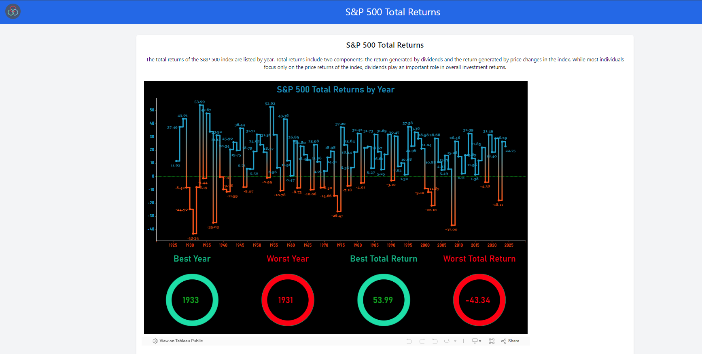
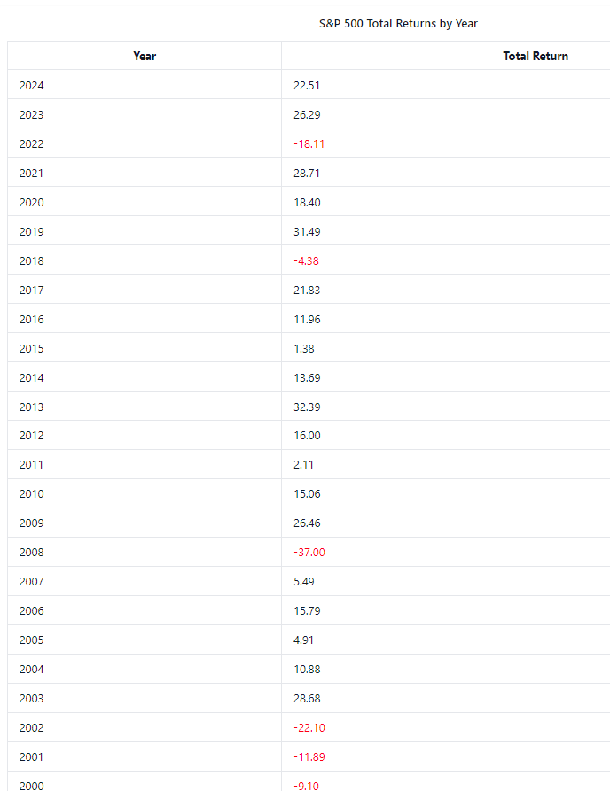

# 🌿 FinChart 🌿

*<i>Welcome to **FinChart**, a platform dedicated to provide insight and analysis on stocks, Graphs for Financials, Custom Dashboard, Improved Speed. Together, we can create a better platform for all the investors through community-driven action and support.</i>*

<br>
<table align="center">
    <thead align="center">
        <tr border: 1px;>
            <td><b>🌟 Stars</b></td>
            <td><b>🍴 Forks</b></td>
            <td><b>🐛 Issues</b></td>
            <td><b>🔔 Open PRs</b></td>
            <td><b>🔕 Close PRs</b></td>
        </tr>
     </thead>
    <tbody>
         <tr>
            <td></td>
            <td></td>
            <td></td>
            <td></td>
            <td></td>
        </tr>
    </tbody>
</table>
</div>
<br>

## Table of Contents

- [About FinChart](#about-wildguard-)
- [Key Features](#key-features-)
- [Hacktoberfest 2024](#hacktoberfest-2024-)
- [How To Contribute](#how-to-contribute-)
- [Tech Stack Behind FinChart](#tech-stack-behind-FinChart-)
- [Installation](#installation-)
- [How You Can Contribute](#how-you-can-contribute-)
- [Get in Touch with Us](#get-in-touch-with-us-)
- [Website Preview](#website-preview)
- [License](#license)

## **About FinChart** 🐾

At **FinChart**, With our dashboard feature, we’ve allowed users to build a customizable list of equities, and choose appropriate metrics/ratios for their use case.The data is of institutional quality, and updated in real-time. 🌍

**Join us** in our mission 💚.

## **Key Features** 💡

- KPIs are provided by our own proprietary FinChart terminal and taken directly from public company filings.
  Global equity fundamentals, ratios and estimates are provided by S&P Market Intelligence.

## Hacktoberfest 2024 🎉

WildGuard is proud to be a part of **Hacktoberfest-2024**!  
We encourage developers and open-source enthusiasts to contribute to our project as part of Hacktoberfest, a month-long celebration of open-source contributions during October.<br>
Come and join us to make an impact in the real world while learning and growing your skills in software development 💻

## **How to Contribute** 🌍

Want to make a difference? Contributing to **FinChart** is simple and impactful! Here's how you can get involved:

1. **Fork & Star** ⭐ the repository to show your support.
2. **Submit a Pull Request** 🔄 with your changes—whether it's fixing a bug or adding an exciting new feature.
3. **Follow the Guidelines** 📜 to ensure that your PR aligns with our contribution standards.

Every contribution, big or small, is valuable and helps us move closer to our goal of protecting the environment and its creatures! 🌱


## **Tech Stack Behind FinChart** 💻

FinChart is powered by modern web technologies to deliver a seamless and impactful experience. Here's the stack that brings it all to life:

- **HTML** 🌐  
  Lays the foundation by structuring the content of the website.
  
- **CSS** 🎨  
  Brings the site to life with visually stunning and responsive styles.
  
- **JavaScript** ⚡  
  Adds dynamic features and interactivity, ensuring a smooth user experience.

Together, these technologies work harmoniously to create an engaging platform that supports every type of investment

## Installation 🚀

You can run FinChart on your local machine by following these steps:

### Steps to Install

1. **Clone the Repository**

   ```bash
   git clone https://github.com/github4maninder/FinChart.git
   cd FinChart
2. **Open the Project**

Locate the `index.html` file in the project folder and open it in your preferred web browser.

3. **Run the Project**

Simply open `index.html` in your browser, and the FinChart website will be up and running!

By working together, we can create a future every invester.

## Get in Touch with Us 💬 

Do you have questions, ideas, or simply want to get involved in our mission? We'd love to hear from you!

🌐 **Visit our website:** [FinChart](https://fin-chart-rouge.vercel.app/)  
📧 **Contact us:** Reach out directly through our website for more information.  
📱 **Follow us on social media** for the latest updates, campaigns, and conservation efforts.

**Join FinChart today and be part of the solution—one step at a time.** 🌱🌍

## Thank You
# Big thanks to being apart of FinChart! 🎉

## Website Preview📸
<br>


<br>

## License 📜 

This project is licensed under the MIT License. For more details, see the [LICENSE](LICENSE) file.
